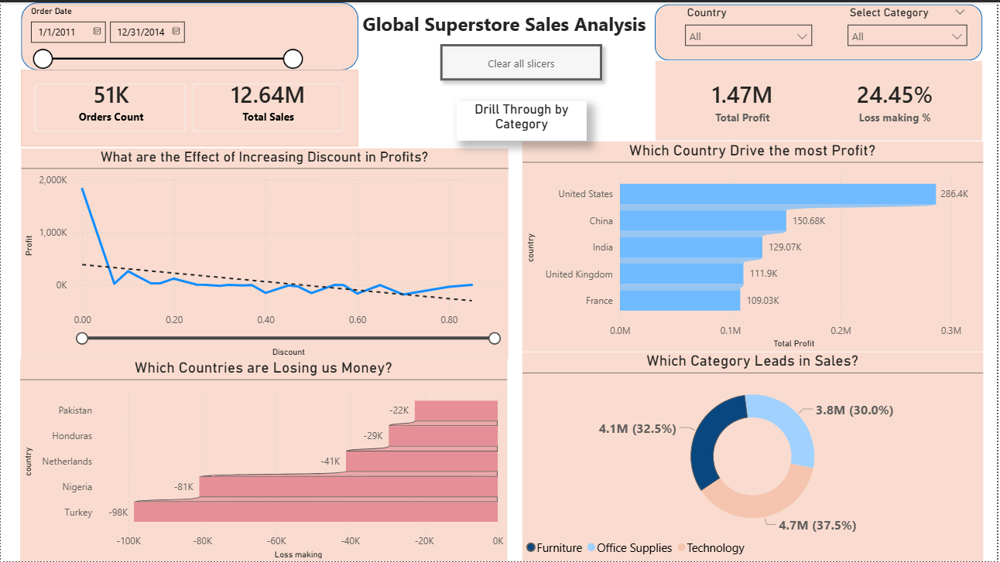
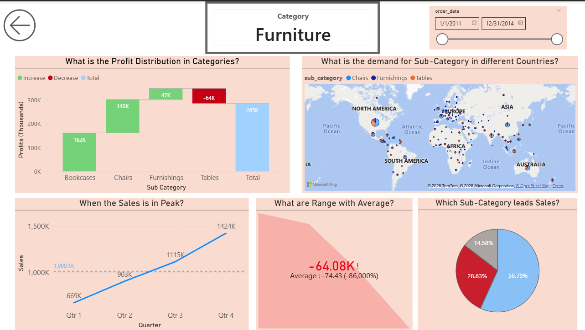
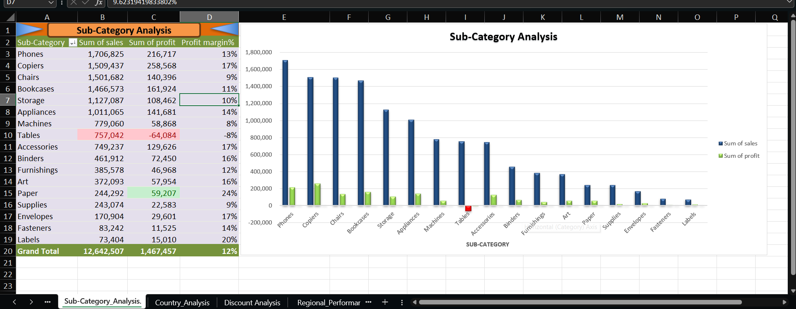
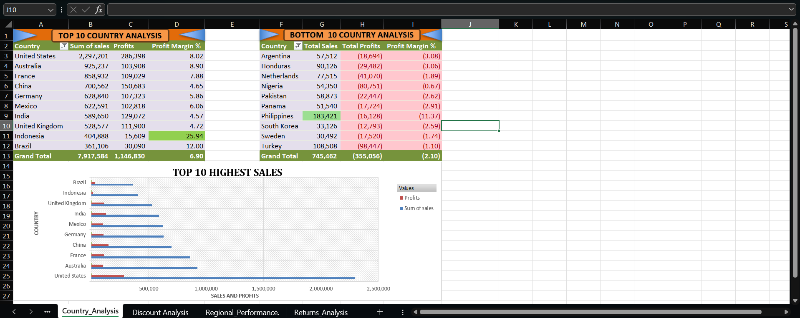
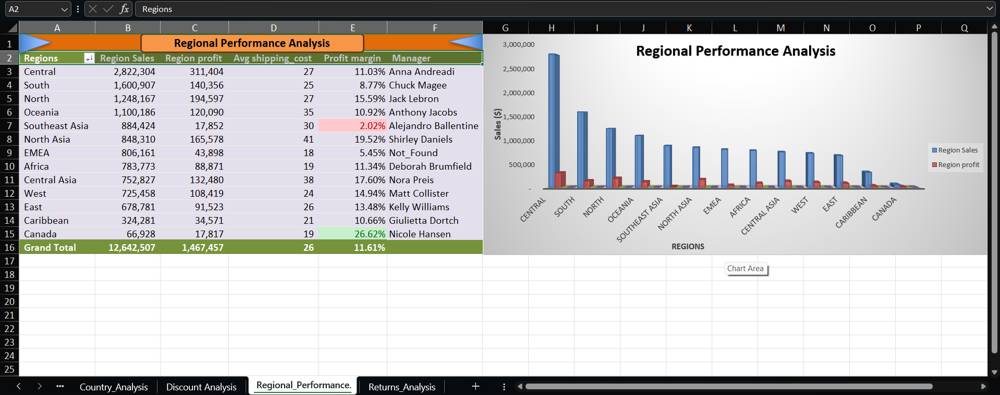
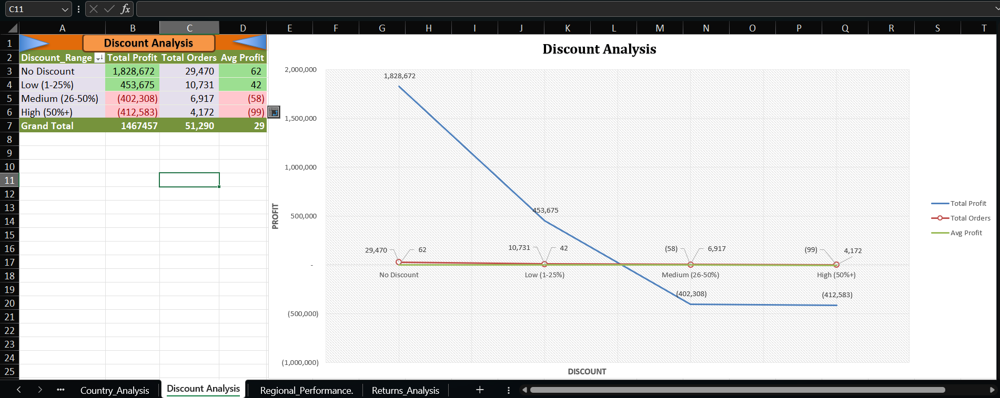
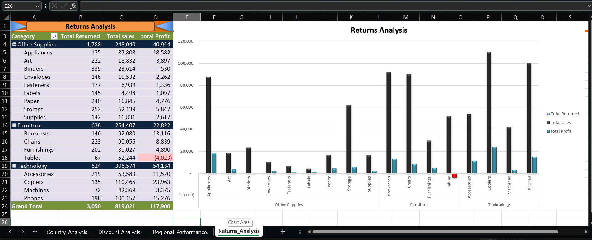

# Global Superstore Sales Analysis

## Project Overview
Retail sales analysis of 51,290 orders across 147 countries (2011–2014).
Tools used: PostgreSQL, Microsoft Excel, and Power BI.

## Key Business Insights
- 24.45% of orders are loss-making due to excessive discounting
- Tables sub-category loses $64,083 despite $757K in sales
- Discounts above 25% guarantee negative profit
- Canada has 27% profit margin — highest but most untapped region
- North Asia has highest shipping cost per product ($4,065)
- Binders are the most returned sub-category (339 returns)

## Dataset
- 51,290 orders | 147 countries | 2011–2014
- Source: Kaggle Global Superstore Dataset

## Power BI Dashboard Preview

## Excel Analysis Preview

## Files in This Repository
| File | Description |
|------|-------------|
| Global_Superstore_Analyst.sql | PostgreSQL analysis — 14 queries across 5 sections |
| Global_Superstore_Sales_Analysis_.xlsm | Excel workbook — 11 sheets with pivot tables and charts |
| Global_Superstore_Sales_Analysis.pbix | Power BI dashboard — 2 pages with drill through |
| Raw_Orders.csv | Original orders dataset — 51,290 rows |
| Raw_Returns.csv | Returns data — 1,173 rows |
| Raw_People.csv | Regional manager data — 13 regions |
| Working_Orders.csv | Cleaned dataset with added columns |
| Working_People.csv | Cleaned manager data |
| Working_Returns.csv | Cleaned returns data |
| Data_Cleaning_Log.csv | Data cleaning steps documented |
| images/ | Dashboard and Excel analysis screenshots |

## Analysis Sections
1. Data Quality Audit
2. Product Performance Analysis
3. Geographic Analysis
4. Operational Analysis
5. Discount Analysis

## Author
**Rupesh Gupta**
BBA Student | Aspiring Data Analyst
[LinkedIn](https://linkedin.com/in/rupeshdataanalyst) | [GitHub](https://github.com/rupesh-gupta-data)
